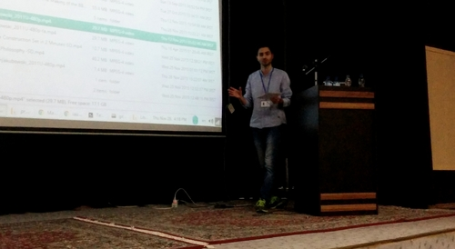

# Open Source Hardware Workshop

Repository for Open Source Hardware Workshop, Open Source Day Event. IAUCTB, 2015.

## Get Started Quickly with Arduino™

- [Arduino Starter kit shop list](arduino_starter_kit.md)
- [Arduino.cc](http://arduino.cc) (English)
- [Arduino.ir](http://arduino.ir) (Persian)  
- [Shop tools and boards online](http://aftabrayaneh.com/) (Iran, Persian)
- [Endless projects and tutorials on _Instructables_](http://www.instructables.com/tag/type-id/category-technology/channel-arduino/) (English)  

## Releases

- [The first release](https://github.com/iauctb/open-hardware-workshop/releases/tag/v1.0)

## Quick links

- The Slideshow: [Open Document Presentation  (Source)](slideshow.odp) - [PDF](https://github.com/iauctb/open-hardware-workshop/releases/download/v1.0/slideshow.pdf)  
- [Copyright notes and attributions of the Presentation](slideshow_sources.md)
- [Links to related videos](video_sources.md)
- [License](LICENSE.md)

---

Except where [otherwise noted](notes.md),
[Open Hardware Workshop](https://github.com/iauctb/open-hardware-workshop) by
[Mohsen Dastjerdi Zade](https://mehsen.com)
is licensed under a
[Creative Commons Attribution-ShareAlike 4.0 International License](https://creativecommons.org/licenses/by-sa/4.0/).
